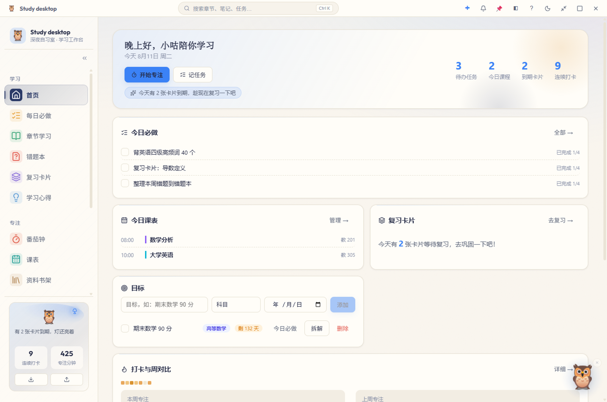
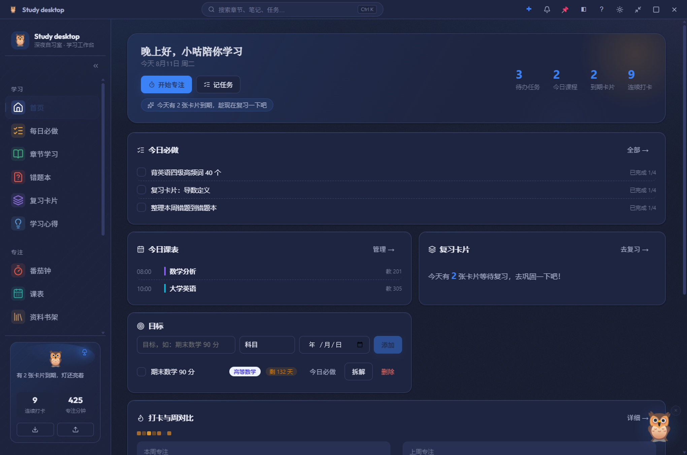
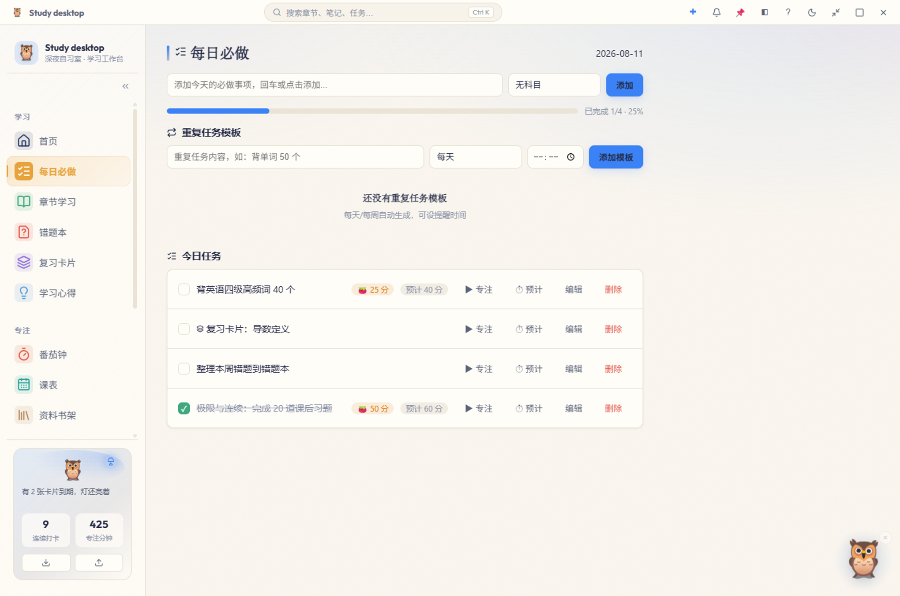
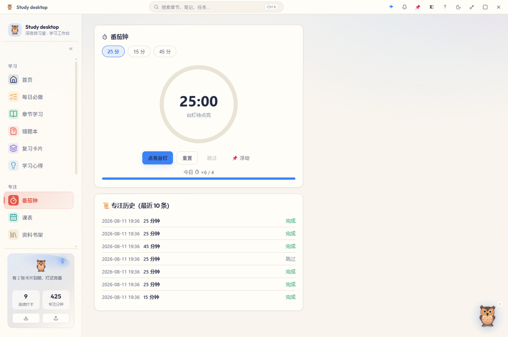
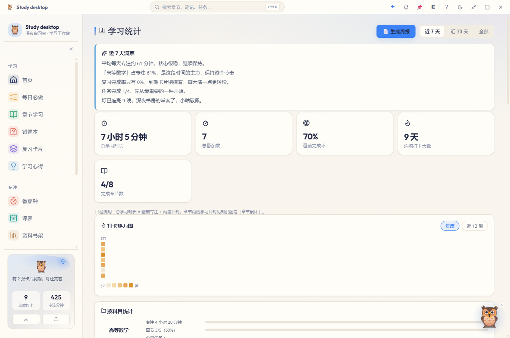

# Study desktop — 桌面端学习工作台

> **深夜书房 · 学习工作台** ｜ 本地优先，数据存于本机。小咕陪你，灯不灭，习惯在灯下慢慢养成。

基于 Electron + React + TypeScript + Vite 的本地学习管理桌面应用。

## 截图预览

| 首页（浅色） | 首页（深色） | 每日必做 |
|---|---|---|
|  |  |  |

| 番茄钟 | 学习统计（洞察建议） |
|---|---|
|  |  |

## 下载安装

**Windows 安装包**（约 127 MB，支持 Win10 / Win11）：

- GitHub Release（官方）：<https://github.com/Myj2054196020/Study-desktop/releases/latest>
- 国内加速下载（无需代理）：<https://ghfast.top/https://github.com/Myj2054196020/Study-desktop/releases/latest/download/Study-desktop-Setup-1.3.6.exe>
- 备用加速：<https://gh-proxy.com/https://github.com/Myj2054196020/Study-desktop/releases/latest/download/Study-desktop-Setup-1.3.6.exe>

- Gitee 镜像（国内直连）：<https://gitee.com/meng-yanjin/study-desktop/releases>
  - 分卷 1：[Study-desktop-Setup-1.3.6.7z.001](https://gitee.com/meng-yanjin/study-desktop/releases/download/v1.3.6/Study-desktop-Setup-1.3.6.7z.001)
  - 分卷 2：[Study-desktop-Setup-1.3.6.7z.002](https://gitee.com/meng-yanjin/study-desktop/releases/download/v1.3.6/Study-desktop-Setup-1.3.6.7z.002)
  - 两个分卷都要下载，用 7-Zip（<https://www.7-zip.org>）打开 `.001` 即可解压出安装包

> 说明：加速链接由第三方代理服务提供，若失效请改用 GitHub 官方链接；百度网盘镜像准备中。

## 习惯养成（每日开灯仪式）

- **今日三件事**：每天第一次打开首页，看到「待办 / 到期卡片 / 专注」三件小事，一键直达，看完当天不再打扰
- **晚间收尾小结**：22 点后首页提示写一句今日收获，自动带上专注 / 必做 / 复习数据存入心得
- **晚间未完成提醒**：可设置到点提醒当天还没完成的必做

## 品牌与体验

- **深夜书房 × 小咕**：猫头鹰吉祥物贯穿全站（侧栏 logo / 空状态 / 新手引导 / 浮动陪伴），台灯之光作为视觉母题（专注=点亮台灯、夜间书房深色氛围、暖光与受光面）。
- **动效签名「小咕跳」**：全站统一的 spring 缓动，卡片/按钮/弹窗有辨识度的反馈手感。
- 浅/深双主题；模块色磁贴导航；中文衬线标题（书卷气）。

## 核心功能

**学习闭环**
- 章节学习：课本-章节树、Markdown + LaTeX（KaTeX）、模板库（含自定义字段）、艾宾浩斯复习计划（1/2/4/7/15/30 天）
- 每日必做：当日任务、重复模板、昨日遗留自动顺延、目标拆解、一键绑定番茄钟；可设预计时长，番茄完成自动回填累计投入，晚间到点提醒未完成项
- 复习卡片：FSRS 间隔重复、到期队列、从章节手动/AI 生成、选中挖空成卡、**卡片自测模式**（错题一键入册）、卡壳建议；复习键盘快捷键（空格翻面 / 1-4 评级）、统计页复习完成率
- 错题本：图片导入 + OCR、错因聚类与加强建议、**导出/打印可打印 HTML**、一键转卡片
- 学习心得：时间线、配图、**Markdown + 公式编辑与实时预览**、每日收尾小结（晚 22 点后提醒，自动带今日数据）
- 目标：立目标、截止日倒计时、**拆解成未来 N 天每日任务**并跟踪进度

**专注与内容**
- 番茄钟：25/15/45 分、圆形进度、复盘闭环（结束即记心得/完成任务）、浮动迷你计时器；与每日必做双向联动（一键专注 / 时长回填）
- 资料书架：内嵌阅读器（PDF/图片），**拖动平移、滚轮缩放、书签、批注转卡片/心得**，阅读计时并入学习统计
- 课表：周视图、到点系统提醒
- B站学习：搜索/收藏夹直达、时间点笔记转卡片

**洞察**
- 学习统计：热力图、番茄/章节/科目多维、**「洞察」建议卡**（本地规则给出可执行建议）、周报/月报（含复习完成率，可 AI 润色）、AI 学习诊断
- 知识图谱：按学科/标签/状态着色、多布局、视图预设、节点详情面板（关联卡片/错题直达）

**AI 助手（可选）**
- 多服务商预设：DeepSeek / OpenAI / Kimi / 智谱 / 通义 / Ollama（本地免 Key）/ 自定义 OpenAI 兼容
- 对话、章节总结、自测、作文批改、学习诊断、周报润色、一键生成卡片

**系统集成**
- 托盘常驻：关闭最小化到托盘（首次提示）、双击/二开桌面图标恢复窗口、右键退出
- 全局快捷键：`Ctrl+Shift+F` 搜索 · `Ctrl+Shift+P` 开始/暂停番茄 · `Ctrl+Shift+T` 快捷添加
- 开机自启（可选后台隐藏）、自动备份（保留 10 份）、文件夹同步（配合网盘）、Obsidian 互通、一键打包分享
- 数据本地 JSON 存储于系统 userData 目录；浏览器演示模式用 localStorage

## 开发运行

    npm install
    npm run dev          # 编译主进程 + 并行启动 Vite + Electron

常用命令：

    npm run build        # 编译 Electron 主进程 + Vite 构建前端
    npm run typecheck    # TypeScript 类型检查
    npm run smoke        # 数据层冒烟测试
    npm run test         # 单元测试
    npm run package      # 打包为安装程序（release/ 目录）

## 目录结构

- electron/       Electron 主进程（main / preload / ipc）
- src/            React 前端（stores / components / lib / types）
- assets/brand/   品牌资源（小咕 SVG/PNG/ICO）
- docs/           产品方案与走查记录
- data/           首次启动示例数据

## 发布

推送 v 开头 git 标签触发 GitHub Actions 构建并发布 GitHub Release：

    git tag v1.3.0
    git push origin v1.3.0